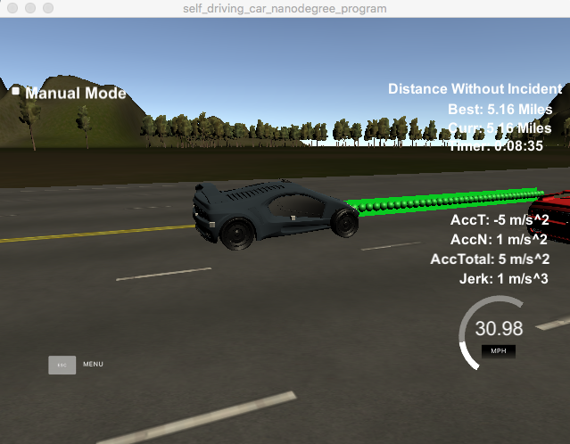

# Path-Planning-Project

## Goals
The goal of this project is safely navigate vehicle around a virtual highway with 50 MPH speed limit. Navigating safely mean no collision, stay within speed limit 50MPh, and satisfy acceleration, jerk requirements. Highway map is given, as well as sensor fusion and localization data about our car and surrounding. The program should send back x,y coordinate in a map position every 0.02 seconds.

## Dependencies

* cmake >= 3.5
* make >= 4.1
* gcc/g++ >= 5.4
* [uWebSockets](https://github.com/uWebSockets/uWebSockets)

## Simulator.

Simulator is available on this [releases tab](https://github.com/udacity/self-driving-car-sim/releases) link.

## Basic Build Instructions

1. Clone this [repo](https://github.com/udacity/CarND-Path-Planning-Project).
2. Make a build directory: `mkdir build && cd build`
3. Compile: `cmake .. && make`
4. Run it: `./path_planning`.

## Spline Function

The implementation is relies on the usage of a [the spline](http://kluge.in-chemnitz.de/opensource/spline/) function, which help smoother the line result.

## Highway Map

Highway map can be found in data/highway_map.csv. It include  a list of waypoints that go all the way around the track. The waypoints are in the middle of the double-yellow diving line in the center of the highway.

The track is about 4.32 miles. If take 5 minutes for it to go all the way around the highway with speed average 50mph.

The highway has 6 lanes total - 3 heading in each direction. Each lane is 4 m wide and the car should only ever be in one of the 3 lanes on the right-hand side. The car should always be inside a lane unless doing a lane change.

## Waypoint Data

Each waypoint has an (x,y) global map position, and a Frenet s value and Frenet d unit normal vector (split up into the x component, and the y component).

The s value is the distance along the direction of the road. The first waypoint has an s value of 0 because it is the starting point.

The d vector has a magnitude of 1 and points perpendicular to the road in the direction of the right-hand side of the road. The d vector can be used to calculate lane positions. The lane is 4 m wide, the middle of the left lane (the lane closest to the double-yellow diving line) is 2 m from the waypoint.

## Implementation

### Gather Previous Data
In this process previous data checked, if small amount of data exist push to simulator otherwise calculate x,y, yaw as a reference point for behavior planning.

### Prediction and Behavior
Find out main car and surrounding cars position. Calculate safe 30m distance. Stay on middle lane if possible. When other car is on the front, slow down or safely change lane. Otherwise if everything is clear speed up to max speed allowed.

### Set Future Path
Future waypoint calculated next car position. Next position calculated in 30m safe distance. Having car behavior input and spline function to smother the point the value than push back to the simulator.

## Result
- The car is able to drive at least 4.32 miles without collision and within 50MPH max speed limit.

### Video

